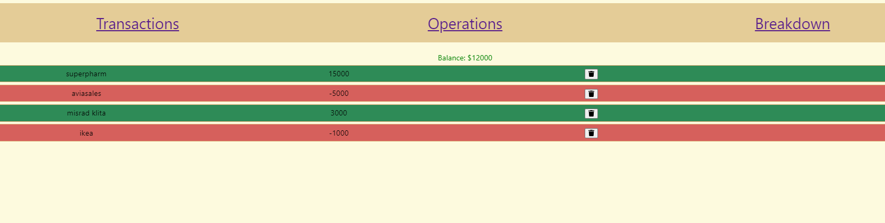
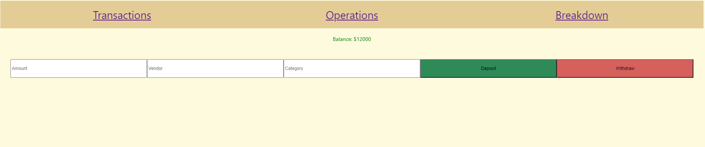
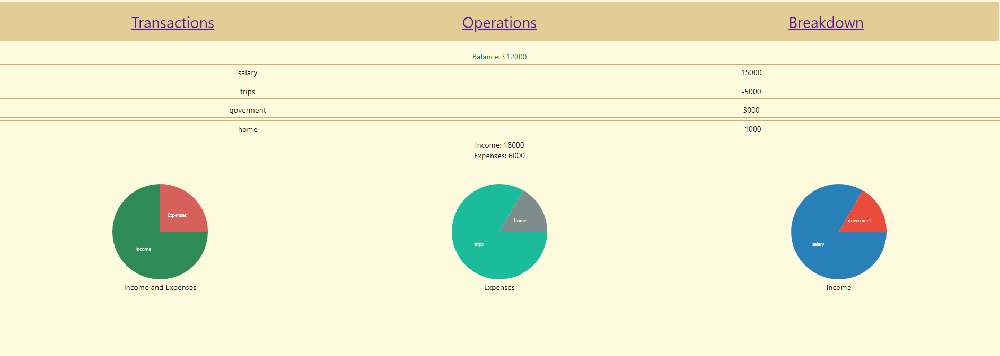

One of the first my MERN projects. The app allows users to track their expenses and view all their expenses by category. Although the design wasn't the core goal of this project, As extension I added some basic pie charts

## Running the project

In the project directory, you can run:
1. Clone the repo
2. Run npm install
3. Run npm run node-server
4. Run mongod
5. Run npm react-dev
6. Navigate to http://localhost:3000 to view it in the browser.

## Screenshots

### Transactions
An overview of all your expenses.

### Add Expense
Fill out the inputs and then either add a new Deposit or a new Withdraw.

### Analytics
A basic overview of your expenses by category, and some simple piecharts as visual aids.

## Techstack

1. Mongoose (MongoDB).
2. Express
3. React
4. Node.js
